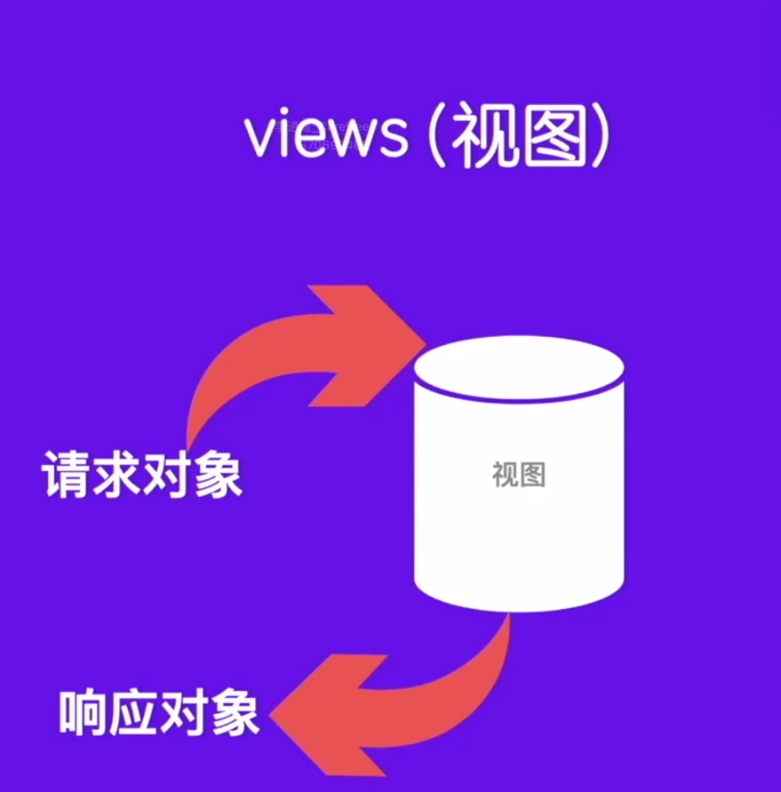

# Learning Django

## 配置git
```
ls ~/.ssh(查看是否有公钥和私钥)
ssh-keygen -t rsa -b 4096 -C "your_email@example.com"(生成公钥和私钥)(在github上添加公钥)
ssh -T git@github.com(测试连接)
git init(初始化)
git config --global user.name "your name"(用户名要和github一致)
git config --global user.email "your email"(邮箱要和github一致)
git remote -v(查看远程仓库)
git remote add origin git@uername:username/repositoryname.git(添加远程仓库)
git push -u origin master(第一次推送)
git add .(添加所有文件)
git commit -m "your message"(提交)
```

## 虚拟环境下安装django
```
python -m venv venv
# 创建虚拟环境
venv\Scripts\activate
# 激活虚拟环境
pip list
# 查看虚拟环境下安装的包
pip install django
# 安装django
```

### 虚拟环境和系统全局Python的区别
每个 Python 项目 都应该使用虚拟环境，避免库冲突和版本问题。
| **是否激活 `venv`** | **Python 解释器** | **安装的库** | **适用场景** |
|----------------|-------------------|------------|------------|
| ✅ **激活** (`venv\Scripts\activate`) | **虚拟环境中的 Python** (`venv\Scripts\python.exe`) | 仅对当前项目有效 | **开发项目、运行代码、管理依赖** |
| ❌ **未激活** | **系统全局 Python** (`C:\Python39\python.exe`) | 影响整个系统 | 仅用于全局 Python 操作 |


## 创建django
```
django-admin startproject demo
# 创建django项目
python manage.py runserver
# 运行django

```

## django的MVT模式

```
MVT 是 Django 框架的核心架构：
Model 负责数据
View 负责逻辑
Template 负责页面展示
```

```
MVT 处理流程
1. 用户访问 URL，Django 的 urls.py 解析请求。
2. View 处理请求，查询 Model 获取数据。
3. 数据传递给 Template，通过 Django 模板语言渲染 HTML 页面。
4. 返回 HTML 响应，展示给用户。
```


## 创建应用
```
# 启动虚拟环境
venv\Scripts\activate
# 进入项目目录
cd demo
# 创建应用
django-admin startapp app
```

## 路由匹配模式
```
URL就是用户输入的网址
路由就是处理URL和视图函数的之间的调度器
路由匹配模式就是将URL和视图函数进行匹配的过程
路由匹配模式1: 字符串精确模式
路由匹配模式2: 路径转换器格式
路由匹配模式3: 正则表达式模式
路由匹配模式4: 路由嵌套模式
```


## Django框架视图和模板

### 1.基于函数视图实现登录功能
views(视图):
一个视图可以称之为函数或者视图类, 本质上是一个python函数或者是类, 用于处理用户的请求并返回响应。

分为: FBV(基于函数的视图)和CBV(基于类的视图)

### 2.基于类的视图实现登录功能


## HttpRequest请求对象
```
请求对象的主要内容：
1. 获取请求头
2. 获取请求参数
```
### 获取请求参数
1. 获取GET参数:
```
value = request.GET.get('parameter_name', default_value)
```
2. 获取POST参数:
```
value = request.POST.get('parameter_name', default_value)
```
3. 获取URL参数(例如在URL中使用的参数):
```
value = request.GET.get('parameter_name', default_value)
```
4. 获取请求体中的JSON参数:
```
data = json.loads(request.body)
value = data.get('parameter_name', default_value)
```
5. 获取路径参数(例如在URL路径中的参数):
```
def my_view(request, parameter_name):
# 使用parameter_name参数
```
6. 获取请求头中的参数:
```
value = request.headers.get('Header-Name', default_value)
```


### GET和POST的区别

`GET` 请求和 `POST` 请求是 HTTP 协议中的两种常见请求方法，它们的主要区别如下：  

|  区别点  | `GET` 请求 | `POST` 请求 |
|---------|----------|------------|
| **用途** | 主要用于获取数据，不会对服务器资源产生影响 | 主要用于提交数据，通常用于修改服务器上的资源 |
| **参数传递** | 参数拼接在 URL 中，形式如 `?key=value&key2=value2` | 参数放在请求体（body）中，通常以 JSON、表单等格式传输 |
| **可见性** | 参数直接暴露在 URL 中，容易被看到 | 参数在请求体中，不直接暴露在 URL |
| **安全性** | 安全性较低，数据可能被缓存、记录到浏览器历史中 | 相对更安全，数据不会出现在 URL 中 |
| **数据长度限制** | 受 URL 长度限制（不同浏览器和服务器限制不同，通常不超过 2000 字符） | 没有长度限制，适合传输大数据 |
| **是否可缓存** | 可以被浏览器或代理服务器缓存 | 默认不会被缓存 |
| **幂等性** | 幂等（同样的请求多次执行，结果相同） | 非幂等（多次执行可能导致服务器数据变化） |
| **书签支持** | 可以存为书签，方便访问 | 不能存为书签 |

---

### **示例：GET 请求**
```python
import requests

url = "https://api.example.com/data"
params = {"id": 123, "name": "LLY"}

response = requests.get(url, params=params)
print(response.text)
```
发送的请求 URL 可能是：
```
https://api.example.com/data?id=123&name=LLY
```

---

### **示例：POST 请求**
```python
import requests

url = "https://api.example.com/submit"
data = {"username": "LLY", "password": "123456"}

response = requests.post(url, json=data)  # 发送 JSON 数据
print(response.text)
```
请求的数据不会出现在 URL，而是在请求体中发送。

---

### **总结**
- **`GET` 适用于查询数据（如查询天气、获取用户信息）。**
- **`POST` 适用于提交数据（如登录、上传文件、提交表单）。**


## HttpResponse响应对象
```
1. HttpResponse
2. JsonResponse
```


## 模板引擎和配置(Template)
Django中的模板就是用来动态生成HTML页面的。
1. 模板引擎和配置
```
DTL, Jinja2
```
2. 模板中的变量
```
数字，字符串，列表，元组，字典，集合，对象
```
3. 模板标签
```
· 循环控制
· 条件控制
· 模板注释
· URL解析
· with语句块
· 时间显示
· 继承语包含
```
```
# 循环列表或元组

<li>内容</li>

<li>暂无内容</li>

```
4. 模板过滤器
5. 模板继承和包含
