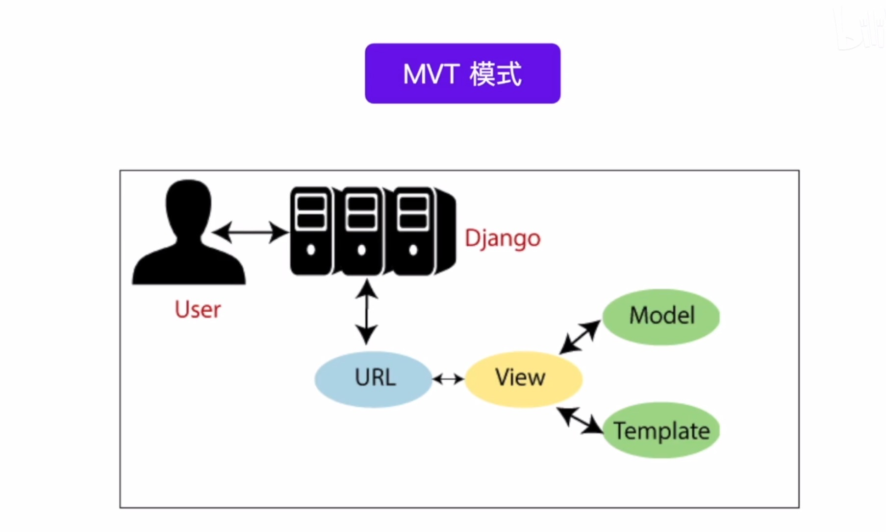

# Learning Django

## 配置git
```
ssh-keygen (生成公钥和私钥)(在github上添加公钥)
git init(初始化)
git config --global user.name "your name"(用户名要和github一致)
git config --global user.email "your email"(邮箱要和github一致)
git remote -v(查看远程仓库)
git remote add origin git@uername:username/repositoryname.git(添加远程仓库)
git push -u origin master(第一次推送)
git add .(添加所有文件)
git commit -m "your message"(提交)
```

## 虚拟环境下安装django
```
python -m venv venv
# 创建虚拟环境
venv\Scripts\activate
# 激活虚拟环境
pip list
# 查看虚拟环境下安装的包
pip install django
# 安装django
```

## 创建django
```
django-admin startproject demo
# 创建django项目
python manage.py runserver
# 运行django

```

## django的MVT模式

```
MVT 是 Django 框架的核心架构：
Model 负责数据
View 负责逻辑
Template 负责页面展示
```

```
MVT 处理流程
1. 用户访问 URL，Django 的 urls.py 解析请求。
2. View 处理请求，查询 Model 获取数据。
3. 数据传递给 Template，通过 Django 模板语言渲染 HTML 页面。
4. 返回 HTML 响应，展示给用户。
```



## 创建应用
```
# 启动虚拟环境
venv\Scripts\activate
# 进入项目目录
cd demo
# 创建应用
django-admin startapp app
```

## 路由匹配模式
```
URL就是用户输入的网址
路由就是处理URL和视图函数的之间的调度器
路由匹配模式就是将URL和视图函数进行匹配的过程
```
### 路由匹配模式1: 字符串精确模式
在 Django 的 URL 路由 中，字符串精确匹配模式 是最基础的 URL 解析方式，它要求访问路径 严格匹配 预定义的字符串。
### 路由匹配模式2: 路径转换器格式

### 路由匹配模式3: 正则表达式模式
### 路由匹配模式4: 路由嵌套模式


